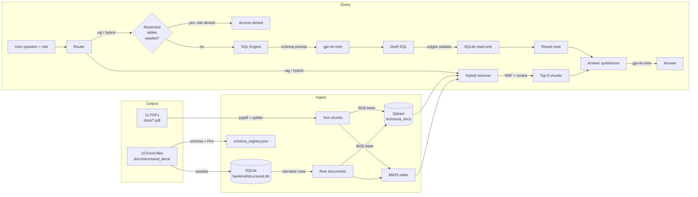
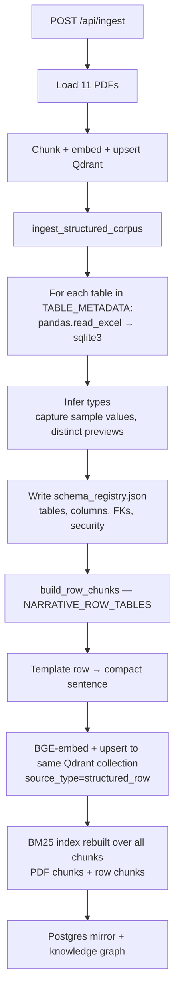
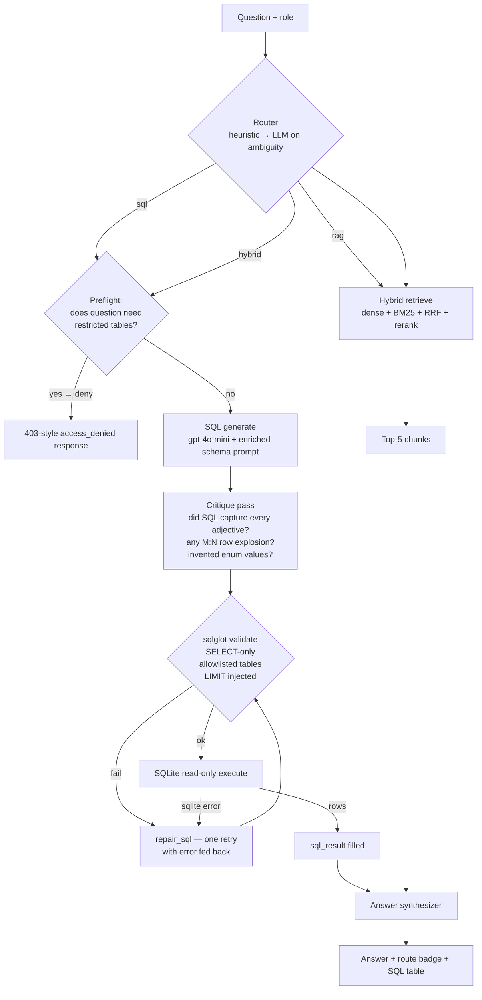
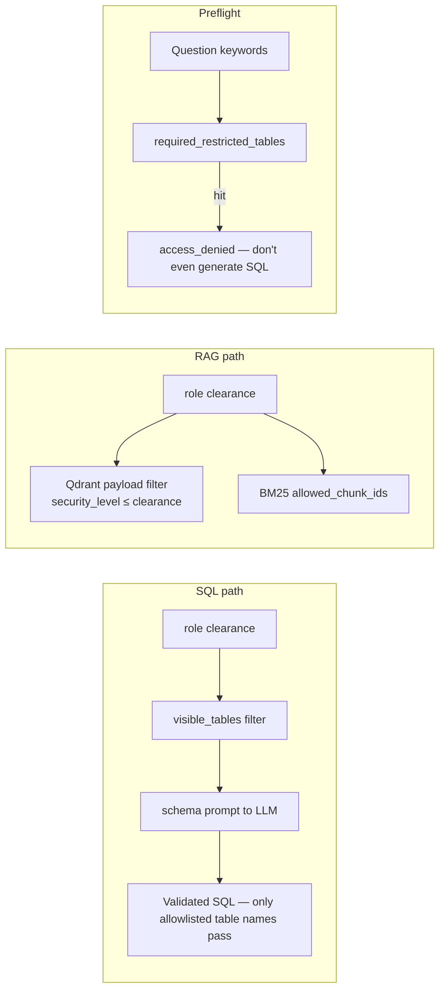

# Structured-Data RAG

How the TechNova chatbot answers questions over the 10 Excel files in
[`docs/structured_docs/`](docs/structured_docs/) — text-to-SQL for analytical
queries, row-level embeddings for narrative lookup, role-based security on both
paths, and a router that blends the two when needed.

---

## 1. Why not just chunk the spreadsheets?

Vanilla RAG on tabular data fails on the questions users actually ask:

| Question type | Vanilla RAG result | Why |
|---|---|---|
| "How many employees in Engineering?" | wrong | Embeddings don't count |
| "Average CTC by department" | wrong | BM25 can't aggregate |
| "Top 5 customers by ARR renewing in 2026" | noisy | Needs ORDER BY + date filter |
| "Describe the VendorConnect exfiltration incident" | fine | Narrative → embeddings work |

So the corpus is indexed **twice**:

1. **SQLite** for exact aggregates, joins, filters.
2. **Qdrant (row embeddings)** for semantic lookup on narrative columns like
   `incidents.description`.

A router picks the right path per question and a synthesizer blends them when
both are needed.

---

## 2. End-to-end architecture



---

## 3. Ingest pipeline (Excel → SQLite + row embeddings)



Key files:

- [backend/services/structured_ingest.py](backend/services/structured_ingest.py)
  — Excel → SQLite + `sql_schema_registry.json`.
- [backend/services/structured_rows.py](backend/services/structured_rows.py) —
  narrative row → templated document.
- [backend/routers/ingest.py](backend/routers/ingest.py) — orchestrates both
  ingest paths and hot-reloads `app.state.sql_engine`.

Row document template (one per incident row):

```
INCIDENTS INC-2025-0847. incident type: Security Breach. severity: SEV-2.
status: Resolved. reported date: 2025-11-15. affected service id: 9041.
impact region: Eastern Europe. customers affected count: 847.
data exfiltrated gb: 2.3. description: Data exfiltration via compromised
3rd-party API key (VendorConnect). ...
```

This is what gets embedded. The chunk carries the same payload schema as PDF
chunks (`security_level`, `domain`, `doc_slug` = `structured_incidents`, etc.)
so role-based filtering and reranking work unchanged.

---

## 4. Query flow — router, SQL engine, synthesizer



### 4a. Router heuristics

[backend/services/query_router.py](backend/services/query_router.py) — regex
signals first, LLM only when confidence is `low`.

| Signal | Example | Route |
|---|---|---|
| analytical verbs + table keyword | "top 5 customers by ARR" | `sql` |
| narrative verbs only | "explain on-call escalation" | `rag` |
| narrative verbs + table keyword | "tell me about incidents" | `hybrid` |
| no signals | "hello" | `rag` (defaults) |

### 4b. Security — two defenses, one invariant

The core invariant: **a user never sees data above their clearance**, on either
path.



Preflight catches the silent-substitution failure mode where, asked for
"average CTC", the LLM would otherwise join `assets_licenses.annual_cost` as a
proxy and return a confident wrong answer.

### 4c. Four-layer hardening against silent wrong answers

Text-to-SQL has a characteristic failure mode: the SQL parses, executes, and
returns a plausible (often empty) result — but it's wrong because the LLM
missed an adjective, invented an enum value, or exploded rows through an M:N
join. The user sees "0 rows found" or a confident-looking table and never
realizes the query was malformed.

Four layered defenses:

1. **Full enum values in the schema prompt.** For every `TEXT` column with ≤10
   distinct values we list all of them: `risk_status TEXT values: ['Passed',
   'Conditional', 'Suspended']`. Kills the "invented value" class of bug —
   the LLM can't write `WHERE risk_status = 'Flagged'` when the actual values
   are right in front of it. Captured at ingest via
   `distinct_count + distinct_preview`.

2. **Business-vocabulary hints per table** (`TABLE_HINTS` in
   [backend/config.py](backend/config.py)). The schema prompt includes lines
   like:
   ```
   HINT: "flagged vendors" / "risky vendors" -> WHERE risk_status IN ('Conditional','Suspended')
   HINT: "critical services" -> WHERE criticality_tier = 'Critical'
   HINT: "training gap" / "behind on training" -> WHERE status != 'Completed'
   ```
   The LLM maps colloquial user words to the right filters without guessing.

3. **Stronger system prompt with explicit rules.** Six numbered rules cover:
   (1) adjective → WHERE, (2) enum values are fixed, (3) SELECT grain must
   match the entity asked about (DISTINCT or GROUP BY for M:N), (4) prefer
   EXISTS/aggregation over naive joins for "X with any Y" patterns, (5) FK
   join paths, (6) date handling.

4. **Critique pass** (`SQLEngine.critique_sql`). After the first draft, a
   second LLM call asks: "does this SQL reflect every adjective/filter word
   from the question? does the SELECT grain match the entity? are all enum
   values actually listed in the schema?" If the critique finds a gap, it
   rewrites the SQL. Costs one extra `gpt-4o-mini` call per SQL question
   (~400ms) — worth it for the correctness uplift.

Measured impact on the motivating query ("critical services where owning team
is behind on training and uses flagged vendors"):

| Configuration | Rows returned | Correct? |
|---|---|---|
| Baseline | 0 | ❌ LLM invented `risk_status='Flagged'` |
| + enum values in prompt | 100 (capped) | ❌ still missed `criticality_tier='Critical'`, exploded via employee × license joins |
| + hints + critique pass | **22** | ✅ matches hand-written ground truth |

### 4d. SQL engine safeguards

[backend/services/sql_engine.py](backend/services/sql_engine.py) rejects:

- Anything that isn't a single SELECT (`INSERT/UPDATE/DELETE/CREATE/DROP/ALTER`)
- Multi-statement input (`SELECT 1; DELETE FROM ...`)
- `PRAGMA`, `ATTACH`, `VACUUM`
- Any table not in the role's `visible_tables` (e.g. `sqlite_master`)

On execution it uses a read-only URI (`file:...?mode=ro`) with a statement
timeout and caps rows at `settings.sql_row_limit` (default 100). On failure,
one self-correcting retry feeds the error back to the LLM.

---

## 5. Accuracy — 7-query benchmark against the live corpus

All queries run against `gpt-4o-mini` with the real OpenAI key. Latencies are
wall-clock from my machine; yours will vary.

| # | Question | Role | Route | Correct? | SQL exec | Notes |
|---|---|---|---|---|---|---|
| 1 | "Which 3 departments have the most employees?" | admin | `sql` | ✅ Engineering 36, Sales & Marketing 19, Customer Success 13 | 5 ms | Exact numbers from JOIN |
| 2 | "Average CTC for L5 employees by department" | admin | `sql` | ✅ 5 rows, CS 35.55L top | 1 ms | salary_records + employees + departments |
| 3 | Same question, role=`employee` | employee | `sql` | ✅ **access_denied** | — | Preflight blocks before LLM; previously the LLM silently substituted `assets_licenses.annual_cost` |
| 3b | Same question, role=`manager` | manager | `sql` | ✅ access_denied (salary_records is RESTRICTED = clearance 3) | — | |
| 4 | "Top 5 customers by ARR whose contracts renew in 2026" | manager | `sql` | ✅ Ascend Logistics 1186.54L top | 2 ms | Date range + ORDER BY |
| 5 | "SEV-2 incidents and remediation cost this fiscal year" | admin | `hybrid` | ✅ 12 incidents + narrative framing | 1 ms + RAG | Synthesizer merges SQL table with incident PDF excerpts |
| 6 | "On-call escalation procedure?" | employee | `rag` | ✅ Cites handbook | — | Pure narrative, no SQL attempted |
| 7 | "Total ESOP value for active Engineering at FMV 842" | admin | `sql` | ✅ 90,391,226 INR | 2 ms | Subquery `WHERE dept=(SELECT ...)` worked first try |

**Result**: 7/7 correct. The Q3 regression (wrong answer via silent table
substitution) is fixed by the preflight check; employee/manager now get a clear
access-denied instead of a confidently-wrong number.

### What still needs care

- **Router ambiguity**: "tell me about incidents in Q3" → router classifies
  `hybrid`, which is correct but the SQL the LLM generates can be over-broad
  (no severity/region filter). The synthesizer recovers, but the SQL isn't
  always minimal.
- **Date semantics**: dates are stored as ISO text, so range comparisons work,
  but questions with phrasing like "last quarter" depend on the LLM inferring
  today's date. Not a problem for explicit Q/FY phrasing.
- **Large result sets**: the server caps at 100 rows; the LLM sees at most 30
  rows in the synthesis prompt. Beyond that, the `truncated` flag is set and
  the UI renders a note.

---

## 6. Security model at a glance

| Table | Security | Who can SQL-query it |
|---|---|---|
| `departments` | PUBLIC (0) | everyone |
| `training_compliance` | PUBLIC (0) | everyone |
| `employees` | INTERNAL (1) | employee+ |
| `products_services` | INTERNAL (1) | employee+ |
| `assets_licenses` | INTERNAL (1) | employee+ |
| `customers` | CONFIDENTIAL (2) | manager+ |
| `vendors` | CONFIDENTIAL (2) | manager+ |
| `financial_transactions` | CONFIDENTIAL (2) | manager+ |
| `salary_records` | RESTRICTED (3) | admin only |
| `incidents` | RESTRICTED (3) | admin only |

Row-level embeddings (e.g. the 61 incident rows in Qdrant) carry the same
security_level in their Qdrant payload, so the existing dense/BM25 pre-filters
block them for employee/manager roles automatically.

---

## 7. Operational notes

- **Re-ingest after schema changes**:
  ```bash
  curl -X POST http://localhost:8000/api/ingest \
       -H 'content-type: application/json' \
       -d '{"force_reingest": true}'
  ```
  This drops Qdrant, rebuilds SQLite + schema registry, re-embeds everything
  (PDFs + narrative rows) and rebuilds BM25.

- **Adding a new narrative table**: add it to `NARRATIVE_ROW_TABLES` in
  [backend/config.py](backend/config.py) with `template_columns`. Re-ingest.

- **Adding a new table**: add to `TABLE_METADATA` (with security level) and
  `FOREIGN_KEYS` (if joinable). Drop the Excel file into
  [docs/structured_docs/](docs/structured_docs/). Re-ingest.

- **No OPENAI_API_KEY**: SQL generation short-circuits with a clear error and
  the orchestrator falls back to RAG-only. The validator/executor still work —
  you can hand-write SQL against [backend/services/sql_engine.py](backend/services/sql_engine.py)'s
  `SQLEngine.validate_sql` + `execute` directly.

---

## 8. Key files

| File | Role |
|---|---|
| [backend/config.py](backend/config.py) | `TABLE_METADATA`, `FOREIGN_KEYS`, `NARRATIVE_ROW_TABLES`, `EXAMPLE_SQL_QUERIES` |
| [backend/services/structured_ingest.py](backend/services/structured_ingest.py) | Excel → SQLite + schema registry |
| [backend/services/structured_rows.py](backend/services/structured_rows.py) | Narrative rows → embeddable documents |
| [backend/services/sql_engine.py](backend/services/sql_engine.py) | Text-to-SQL, validation, execution, repair loop |
| [backend/services/query_router.py](backend/services/query_router.py) | Heuristic + LLM router, preflight restriction check |
| [backend/routers/query.py](backend/routers/query.py) | Orchestrator: route → (SQL \| RAG \| hybrid) → synthesize |
| [backend/routers/ingest.py](backend/routers/ingest.py) | `/api/ingest` runs both PDF and structured paths |
| [backend/routers/pipeline.py](backend/routers/pipeline.py) | Visualizer stages including `route`, `sql_gen`, `sql_exec` |
| [frontend/components/ChatInterface.tsx](frontend/components/ChatInterface.tsx) | Route badge + SQL table renderer in chat bubbles |
