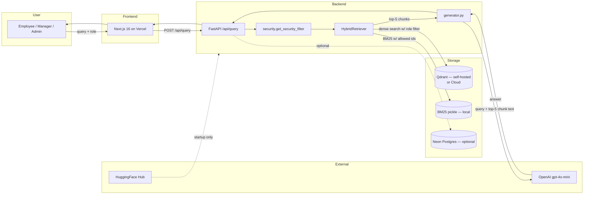

# TechNova RAG — PII Inventory & Sub-Processors

**Owner:** TechNova AI Risk & Governance (jointly with Data Protection Office)
**Classification:** INTERNAL
**Last Reviewed:** 2026-04-16
**Next Review:** 2026-10-16
**Version:** 1.0

This document inventories personal data (PII) present in the TechNova RAG corpus and user interactions, enumerates every sub-processor that receives TechNova data, and describes the data flows, retention defaults, and data-subject-rights procedures for each. It is written to support GDPR Article 30 records-of-processing, EU AI Act Art. 11 technical documentation, and vendor due-diligence requests.

---

## 1. PII in the Corpus

The corpus consists of 11 PDFs in `/Users/viditkbhatnagar/codes/technova-rag/docs/`, each mapped in `backend/config.py::DOCUMENT_METADATA` with a `security` level. PII exposure scales with security level.

| Document | Security | PII content | PII categories | Notes |
|---|---|---|---|---|
| `Training_Compliance` | PUBLIC | None | — | Compliance training completion framing; no named individuals. |
| `HR_Policy_Handbook` | INTERNAL | Low | Example names (illustrative) | Names are fictional policy examples, but are embedded verbatim in chunks. Treated as PII out of caution. |
| `IT_Asset_Policy` | INTERNAL | Low | Role titles, no names | Process-focused. |
| `Platform_Architecture` | INTERNAL | Negligible | Team/role names | Engineering contact rotations only. |
| `OnCall_Runbook` | INTERNAL | Medium | Named on-call contacts, phone numbers | Operational identifiers — names + internal contact. |
| `Q4_Financial_Report` | CONFIDENTIAL | Low | Signatories | Typically C-suite names as signers. |
| `Product_Roadmap_2026` | CONFIDENTIAL | Low | PM/Eng lead names | Attribution of initiatives. |
| `Vendor_Contracts` | CONFIDENTIAL | Medium | Vendor contact names, emails | Third-party PII: vendor reps. |
| `Salary_Structure` | **RESTRICTED** | **High** | Employee names + compensation | Most sensitive. Special-category-adjacent (financial). |
| `Board_Minutes_Q4` | **RESTRICTED** | **High** | Board member names, discussion attributions, votes | May include special-category indicators (health-related leaves, litigation). |
| `Security_Incident_Report` | **RESTRICTED** | **High** | Individual actors in incidents, internal usernames | Possible reputational harm if leaked. |

A full per-chunk PII classification is tracked out-of-band by the Data Protection Office; the doc-level classification above is the contract that drives Qdrant payload filtering.

---

## 2. PII in User Interactions

| Source | Field | PII risk | Handling |
|---|---|---|---|
| `/api/query` request body | `query: str` | Medium — users may paste colleague names, IDs, ticket numbers | Transits to OpenAI in the generator prompt. Logged in Postgres chat history if `DATABASE_URL` is set. |
| `/api/query` request body | `role: str` | Low — role only, no identity in v1.0 | Controls pre-filter; retained with history. |
| Chat history in Postgres (Neon) | `session_id, role, query, answer, retrieved` | Medium | Optional — absent if `DATABASE_URL` is unset. Retention per deployment; default 90 days. |
| Corpus mirror in Postgres | Chunk text + metadata | Inherits corpus PII classification | Optional. Mirrors what is already in Qdrant; adds SQL-queryability for the `/documents` UI. |
| Frontend client telemetry | None (v1.0) | — | No analytics SDK shipped in v1.0. |

v1.0 does **not** run PII redaction on user queries. Queries transit to OpenAI verbatim as part of the generator prompt. Presidio-based redaction is a v1.2 roadmap item (§ 5).

---

## 3. Sub-Processor Register

Every third-party processor that may receive TechNova data in any runtime path is listed. Optional processors are flagged. "Data received" describes the maximum observable data — not all deployments activate each row.

| # | Name | Role | Data received | Purpose | Retention | Region(s) | DPA / Terms | Status |
|---|---|---|---|---|---|---|---|---|
| 1 | **OpenAI** | LLM provider | User query + top-5 retrieved chunks (including chunk text, doc name, `chunk_id`) | Answer generation (`gpt-4o-mini`) | Up to 30 days abuse-monitoring retention per OpenAI API policy; zero-training default | US (default routing) | OpenAI Business Terms; DPA executed 2025-12 | **Required** for generation; optional for demo (unset `OPENAI_API_KEY`) |
| 2 | **Neon** | Managed Postgres | Session metadata, chat history (queries + answers + retrieved), corpus mirror (chunk text + metadata) | Chat history, `/documents` browsing | Deployment-configurable; default 90 days for chat history, indefinite for corpus mirror | `us-east-2` and `eu-central-1` selectable | Neon Data Processing Addendum | Optional — absent if `DATABASE_URL` unset |
| 3 | **Qdrant Cloud** | Managed vector DB | Chunk embeddings (768-dim vectors) + payloads (chunk text + metadata) | Vector search | Indefinite until corpus re-ingest | Region per cluster | Qdrant Cloud DPA | Optional — self-hosted is the default |
| 4 | **Vercel** | Frontend hosting | HTTP logs (IPs, paths); no corpus or chat content | Next.js SSR + edge | Vercel default retention | Edge regions | Vercel DPA | Required for hosted frontend; not required for local dev |
| 5 | **HuggingFace Hub** | Model registry | **No runtime data.** Model weights downloaded once at startup (BGE, reranker, spaCy) | Model distribution | N/A — outbound only | Global CDN | HF Terms of Service | Required at first boot; no subsequent calls |
| 6 | **Anthropic (for code assistance only)** | Engineering tooling | Source code excerpts during development | Not a runtime processor | N/A | US | Anthropic Commercial Terms | Out of scope — engineering-only, no TechNova user data |

Rows 1, 2, and 3 are material; rows 4 and 5 are standard infrastructure-level exposure. Row 6 is excluded from the production runtime register and is listed for completeness only.

### 3.1 OpenAI specifics

- **Default model:** `gpt-4o-mini` (snapshot 2024-07-18 as of this doc).
- **Data TechNova sends per query:** assembled prompt containing the system prompt (not secret), the retrieved top-5 chunks verbatim, and the user query. For RESTRICTED-adjacent queries where access is denied, the LLM is **not called** — the access-denied template is emitted locally by the pipeline.
- **Training opt-out:** default for API tier — OpenAI does not use API inputs/outputs to train models.
- **Abuse monitoring:** 30-day retention window; may be held longer in specific investigation contexts per OpenAI policy.
- **Zero-retention option:** available to enterprise tiers on application. TechNova has not activated it in v1.0; tracked for v1.1.

### 3.2 Neon specifics

- Activated by setting `DATABASE_URL`. With it unset, `backend/main.py` skips Postgres initialisation and the corpus/chat-history features degrade gracefully.
- Corpus mirror replicates chunks already held in Qdrant; no new PII class introduced beyond the Qdrant payload.
- Chat history schema: `sessions(id, created_at, role)`, `messages(session_id, ts, role, content, retrieved_json)`. Queries and answers are stored in `content`; retrieved chunk IDs and text are serialised in `retrieved_json`. This is the single most PII-relevant row in the register.

### 3.3 Qdrant specifics

- Default deployment: self-hosted via Docker Compose — **no data leaves TechNova infrastructure.**
- Optional: Qdrant Cloud. If used, the collection `technova_docs` with its full payload (chunk text, doc name, security level) is transferred.
- Payload-indexed fields: `doc_slug`, `security`, `chunk_id`. These are the filter targets used by `get_security_filter`.

---

## 4. PII Flow Diagram

PII leaves the TechNova perimeter through exactly two paths: (a) OpenAI for generation, (b) Neon Postgres when chat history is enabled. Every other leg is local unless Qdrant Cloud is opted into.

---

## 5. Redaction Strategy

### 5.1 v1.0 — current

**No automated PII redaction.** Content transits verbatim. This is acceptable for v1.0 because:

- Corpus is internal and TechNova has a lawful basis for internal processing.
- OpenAI's default non-training guarantee covers the outbound leg.
- Restricted content never reaches OpenAI thanks to the pre-filter.

It is **not acceptable** for a future user-upload feature or an external-customer deployment.

### 5.2 v1.2 roadmap — Presidio pre-LLM redaction

Planned pipeline insertion point: between `retriever.retrieve` and `generator.generate`.

| Stage | Action |
|---|---|
| Chunk text entering prompt | Microsoft Presidio scan for 15 PII entity types |
| Default action | Replace with `[REDACTED:<entity_type>]` token |
| Role-appropriate allowlist | Admin-tier queries may see names in HR context; employee queries never do. Configurable in `backend/config.py::REDACTION_POLICY`. |
| Audit | Every redaction logged with entity type + source chunk_id |
| Failure mode | Redactor down → fallback to full redaction (safer default) |

Measurement plan: faithfulness must drop by < 3 pp vs baseline; over-redaction rate < 5% of answers.

---

## 6. Data Subject Rights (GDPR Arts. 15–22)

Applies to TechNova employees whose personal data appears in the corpus and to users whose interactions are logged.

| Right | Scope in TechNova RAG | Procedure |
|---|---|---|
| Access (Art. 15) | All chat history rows for that user; all corpus chunks naming them | Request to `dpo@technova.internal` → DPO runs a SQL query against `messages` keyed by `session_id` (mapped to user via SSO once v1.1 ships) and a Qdrant scroll filtered by entity match via spaCy NER on doc text. Response within 30 days. |
| Rectification (Art. 16) | Corpus content only — chat history is not rectified (it is a record). | Corpus fix → admin edits source PDF → triggers `/api/ingest?force_reingest=true` → new embeddings + BM25 + graph. |
| Erasure (Art. 17) | Corpus: delete chunks referencing the data subject; Chat: delete session rows. | Qdrant: delete points by payload filter (`entity = X`). Postgres: `DELETE FROM messages WHERE session_id IN (...)`. Propagates to corpus mirror via ingest. |
| Restriction (Art. 18) | Flag session rows as restricted-from-processing while a complaint is open | Add `restricted=true` column filter in chat retrieval path. |
| Portability (Art. 20) | Chat history only (corpus is not user-generated) | Export session rows as JSON; schema in § 3.2. |
| Objection (Art. 21) | Objection to processing for a given session | Treated as erasure for that session going forward; historical rows retained per legal-basis contract with employer. |
| Automated decisions (Art. 22) | **Not applicable.** TechNova RAG does not make automated decisions about individuals; see `EU_AI_ACT_CLASSIFICATION.md` § 2. | — |

Requests are routed via the standard TechNova DPO intake. SLAs are the statutory GDPR deadlines.

---

## 7. Cross-Border Transfers

| Export path | Mechanism |
|---|---|
| EU user query → OpenAI US | Standard Contractual Clauses (EU Commission 2021/914) + OpenAI's published transfer impact assessment |
| EU user → Neon `eu-central-1` | No cross-border transfer — data stays in EU |
| EU user → Neon `us-east-2` (if selected) | SCCs |
| Any user → Vercel Edge | SCCs for EU traffic; Vercel DPA covers |
| Any user → Qdrant Cloud (optional) | Cluster region determines; SCCs where cross-border |

TechNova's default stance for EU users: backend and Postgres pinned to EU regions; OpenAI US transfer under SCCs is documented to the data subject at onboarding.

---

## 8. Retention Matrix

| Data | Location | Default retention | Configurable? |
|---|---|---|---|
| Corpus PDFs | Source of truth in `docs/`, mirrored into Qdrant + optional Postgres | Until source is replaced or deleted | Yes — admin-driven |
| Chunk embeddings | Qdrant `technova_docs` | Until re-ingest | Yes |
| BM25 index | `backend/bm25_index.pkl` | Until re-ingest | Yes |
| Chat history | Neon `messages` | 90 days | Yes (per deployment) |
| OpenAI abuse logs | OpenAI | 30 days default | No (managed by OpenAI) |
| Model weights | HuggingFace cache on host | Until cache purge | Yes |
| Frontend HTTP logs | Vercel | Vercel default | Limited |

A legal-hold override can extend retention on any row on DPO request.

---

## 9. Open Items

| Item | Owner | Target |
|---|---|---|
| Activate OpenAI zero-retention tier | Procurement + AI Platform | v1.1 |
| Ship Presidio redaction | AI Platform | v1.2 |
| Server-side identity (SSO) to replace frontend role selector | AI Platform + Security | v1.1 — blocker for production |
| DPO intake form for RAG-specific requests | DPO | 2026-06 |
| Automated nightly PII-in-answer scan | AI Risk | v1.2 |

---

## Revision History

| Version | Date | Author | Summary |
|---|---|---|---|
| 1.0 | 2026-04-16 | TechNova AI Risk & Governance | Initial release. |
