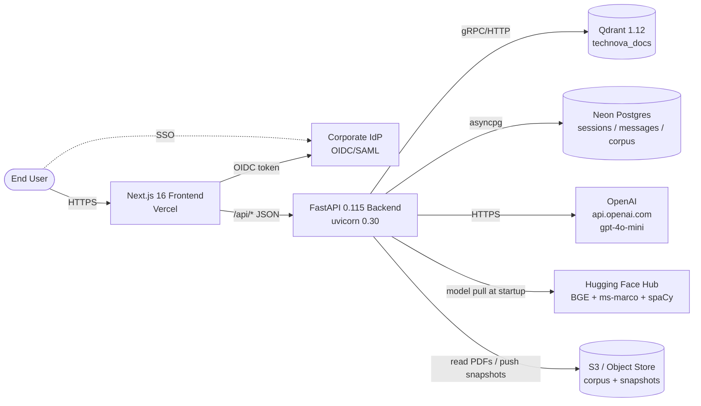
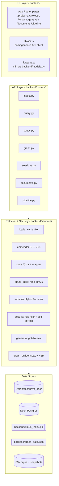
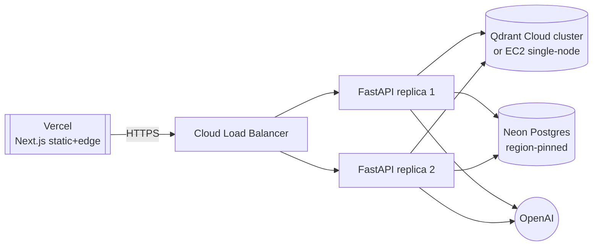

# TechNova RAG — High-Level Design (HLD)

**Owner:** TechNova Platform Engineering
**Classification:** INTERNAL
**Last Reviewed:** 2026-04-16
**Next Review:** 2026-10-16
**Version:** 1.0

---

## 1. Goals and Non-Goals

### 1.1 Goals

TechNova RAG is an advisory Q&A platform that produces grounded, citation-bearing answers over a fixed corpus of eleven internal PDFs located in `docs/`. The system exists to reduce the time that internal employees, field engineers, and vetted partners spend searching across disparate policy, architecture, and operations documents, and to provide a defensible audit trail for every answer it returns.

Concretely, the platform must:

1. Serve two product surfaces from a single retrieval pipeline: **Project A** (open chat, all documents accessible), and **Project B** (role-gated secure chat with clearance-based filtering).
2. Provide an interactive 3D knowledge graph (`/knowledge-graph`) and a 3D pipeline visualizer (`/pipeline`) for explainability.
3. Expose a browsable corpus UI at `/documents` that mirrors the ingested corpus from Postgres.
4. Maintain conversational context via `sessions` and `messages` tables in Neon Postgres when `DATABASE_URL` is configured.
5. Offer deterministic degradation paths when OpenAI or Postgres is unavailable.
6. Keep latency envelope p50 < 900 ms for retrieval (excluding OpenAI generation).

### 1.2 Non-Goals

| Non-Goal | Rationale |
|---|---|
| System of record | The corpus PDFs remain authoritative; TechNova RAG never mutates source documents. |
| Automated decision system | Output is advisory and must be reviewed by a human before any consequential action. |
| Real-time ingestion of external feeds | The corpus is fixed per release; new documents require a controlled ingest cycle. |
| Multilingual corpus | The BGE embedder (`BAAI/bge-base-en-v1.5`) and spaCy (`en_core_web_sm`) are English-only in v1.0. |
| Fine-tuning of the LLM | `gpt-4o-mini` is consumed as a managed service; fine-tuning is not in scope. |
| Write operations from chat | Chat is read-only over the corpus; tool-calling into backends is a v1.2 roadmap item. |

---

## 2. System Context

The system context below shows the trust boundaries and external dependencies. The backend is the only component trusted to talk to Qdrant, Postgres, OpenAI, and the Hugging Face Hub.

The frontend is a static Next.js deployment on Vercel; it holds no secrets that can reach Qdrant, Postgres, or OpenAI. All privileged calls traverse the FastAPI backend, which is the single enforcement point for the role/clearance model declared in `backend/config.py` (`SECURITY_LEVELS`, `ROLE_CLEARANCE`, `DOCUMENT_METADATA`).

---

## 3. Logical Architecture

TechNova RAG follows a four-layer partition. Each layer has one responsibility and a narrow contract to the next.

### 3.1 Layer responsibilities

| Layer | Responsibility | Key files |
|---|---|---|
| UI | Routing, rendering, state, and presentation; never enforces authorization. | `frontend/app/*`, `frontend/lib/api.ts`, `frontend/lib/types.ts` |
| API | HTTP shape, request validation via pydantic, session mapping. Thin — no business logic. | `backend/routers/*`, `backend/models.py` |
| Retrieval + Security | Hybrid retrieval, role-based filtering, self-correcting loop, generation, graph construction. | `backend/services/*` |
| Data | Durable storage of vectors, chat history, BM25 index, graph JSON, and corpus PDFs. | Qdrant, Postgres, local pickle + JSON, S3 |

### 3.2 Request lifecycle (query path)

1. Frontend posts `{query, role?, session_id?}` to `/api/query`.
2. FastAPI resolves singletons from `app.state` (embedder, store, bm25, retriever, chat_store) — these are loaded once in the `lifespan` context in `backend/main.py` and never re-instantiated per request.
3. For Project B, `backend/services/security.py` derives the Qdrant payload filter from `ROLE_CLEARANCE` and the list of chunk IDs allowed to enter the BM25 pool.
4. `HybridRetriever.retrieve` runs dense (Qdrant HNSW, top-10) and lexical (BM25, top-10) in parallel, fuses via RRF (`k=60`), and reranks with `cross-encoder/ms-marco-MiniLM-L-6-v2` to top-5.
5. The generator assembles a system prompt + retrieved chunks and calls `gpt-4o-mini`.
6. If OpenAI is unreachable or `OPENAI_API_KEY` is unset, the endpoint returns `prompt + chunks` without an answer — this is an intentional, contract-preserving degradation.

---

## 4. Deployment Topology

### 4.1 Single-tenant default (v1.0)

This is the supported production topology.

- Two-plus stateless FastAPI replicas behind a load balancer; each replica loads models at startup from a shared model cache volume.
- One Qdrant collection `technova_docs` (768-dim, cosine, payload-indexed on `security_level` and `doc_slug`).
- One Neon Postgres branch per environment (`prod`, `staging`, `dev`).
- BM25 pickle (`backend/bm25_index.pkl`) and graph JSON (`backend/graph_data.json`) are rebuilt on first ingest per replica or pulled from a shared volume; they are derivable artifacts, not sources of truth.

### 4.2 Multi-tenant — Roadmap v1.1

Multi-tenancy is not supported in v1.0. The planned topology is strict data-plane isolation:

| Concern | Approach | Notes |
|---|---|---|
| Vectors | One Qdrant collection per tenant (`technova_docs_{tenant_id}`) | Keeps payload filters simple; isolates blast radius. |
| Relational | One Postgres schema per tenant (`tenant_{id}.sessions`, `tenant_{id}.messages`) | Row-level duplication avoided; schema-level is simpler to reason about. |
| BM25 / graph | Per-tenant artifacts under `backend/state/{tenant_id}/` | Prevents tenant X queries from reaching tenant Y lexical pool. |
| Router | Tenant ID extracted from verified IdP claim, then bound to `request.state.tenant` | Never trust a header alone. |

### 4.3 Data residency

| Component | Default region | EU-tenant option |
|---|---|---|
| Neon Postgres | `us-east-2` | Pin to `eu-central-1`; Neon supports region-scoped branches. |
| Qdrant | Co-located with Postgres | Move to `eu-central-1` Qdrant Cloud cluster. |
| OpenAI | US (api.openai.com) | Use OpenAI EU data residency offering (Enterprise tier); configure via `base_url` in generator. |
| Hugging Face | Model pulls cached to persistent volume at first start; no request-time residency concern. | |

---

## 5. Scale Boundaries

Current corpus is eleven PDFs totalling roughly 300–400 chunks. This size is trivial for the stack and sets the baseline envelope.

| Dimension | Today | 10x | 100x | 1000x (v1.3) |
|---|---|---|---|---|
| Documents | 11 | ~110 | ~1.1K | ~10K |
| Chunks | ~400 | ~4K | ~40K | ~1M |
| Qdrant | single-node | single-node, HNSW default | single-node with tuned `ef_construct`, on-disk payload | sharded cluster, quantized vectors |
| BM25 | rank_bm25 pickle | pickle | pickle is borderline (~50 MB, 2-4s load) | migrate to Elasticsearch / OpenSearch |
| Reranker throughput | CPU 5 docs / query | CPU | single GPU node | dedicated GPU fleet |
| Embedder | BGE on MPS (dev) / CPU (prod) | CPU | dedicated embed node (MPS/CUDA) | horizontal embed service with batching |

The BM25-to-Elasticsearch migration and Qdrant sharding are both tracked as **Roadmap v1.3**.

---

## 6. Failure Isolation

The pipeline is designed to survive partial failure. The degradation map below is the contract against which alerts are tuned.

| Failure | Observable | System behavior | User-visible |
|---|---|---|---|
| OpenAI unavailable or `OPENAI_API_KEY` missing | Generator returns `None` answer | `/api/query` returns `{answer: null, prompt, sources, retrieval_stats}` | Frontend renders the sources and a banner noting the LLM step was skipped. |
| Qdrant unavailable | `store.search` raises | `/api/query` returns 503 with retryable error code | Frontend shows retry; health dashboards page on-call. |
| Postgres unavailable | `chat_store` write fails | Query pipeline continues; history is not persisted for that turn | Session UI shows "history temporarily unavailable". |
| Reranker model load fails | Startup fails fast | FastAPI exits; ALB removes from pool | 503 at LB until at least one replica starts successfully. |
| spaCy model missing | `graph_builder` falls back to co-occurrence edges | Graph is less rich but not empty | `/knowledge-graph` degraded, with a banner. |
| BM25 pickle corrupt | Retriever returns dense-only results, `retrieval_method=dense` | Recall drops on exact-token queries | Surfaced via metric `technova_bm25_fallback_total` (v1.1). |

Isolation is enforced by keeping each external call inside a service module with its own error boundary, and by returning structured error codes rather than raising raw exceptions to the router.

---

## 7. Tech Decision Summary

The decisions below are each tracked in an Architecture Decision Record under `industry-documents/architecture-and-ops/ADR_*`. Future changes must supersede the relevant ADR rather than edit it in place.

| Decision | Status | ADR |
|---|---|---|
| Hybrid dense + BM25 retrieval with RRF | Accepted 2026-02-26 | ADR_0001_hybrid_retrieval_with_rrf.md |
| BGE-base over MiniLM for embeddings | Accepted | ADR_0002 (pending) |
| Qdrant over pgvector for primary vector store | Accepted | ADR_0003 (pending) |
| Pre-filter at both dense and lexical stages for Project B | Accepted | ADR_0004 (pending) |
| Cross-encoder rerank before generation | Accepted | ADR_0005 (pending) |
| gpt-4o-mini as default generator | Accepted | ADR_0006 (pending) |

---

## 8. Open Risks

| Risk | Likelihood | Impact | Mitigation |
|---|---|---|---|
| OpenAI price or availability change | Medium | High on cost, Medium on availability | Adapter layer in `generator.py`; v1.2 swap-in vLLM + Llama 3. |
| BM25 pickle divergence from Qdrant after partial ingest | Low | High (Project B invariant) | Ingest is transactional in contract — either both updated or force full re-ingest. Runbook R-05. |
| Qdrant single-node blast radius | Medium | High | Daily snapshots to S3; roadmap migration to clustered Qdrant for Enterprise tier. |
| Model pull failures from Hugging Face at startup | Low | Medium | Persistent model cache volume; pinned model revisions; fallback to last-good cached models. |
| PII leakage via chunks into logs | Low | High | Log schema in OBSERVABILITY_PLAN.md forbids raw chunk text at default log level. |
| Clearance drift between `ROLE_CLEARANCE` and deployed identity provider claims | Medium | High | Periodic reconciliation job (v1.1) compares IdP groups to `ROLE_CLEARANCE`. |
| Corpus update without BM25 rebuild | Medium | Medium | `/api/ingest?force_reingest=true` is the only supported corpus-change path; gated by admin role. |

---

## 9. Revision History

| Version | Date | Author | Change |
|---|---|---|---|
| 1.0 | 2026-04-16 | TechNova Platform Engineering | Initial release |
