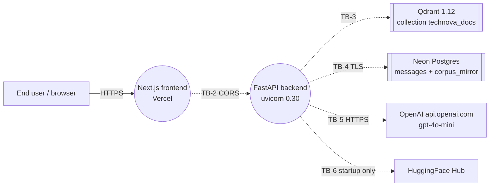
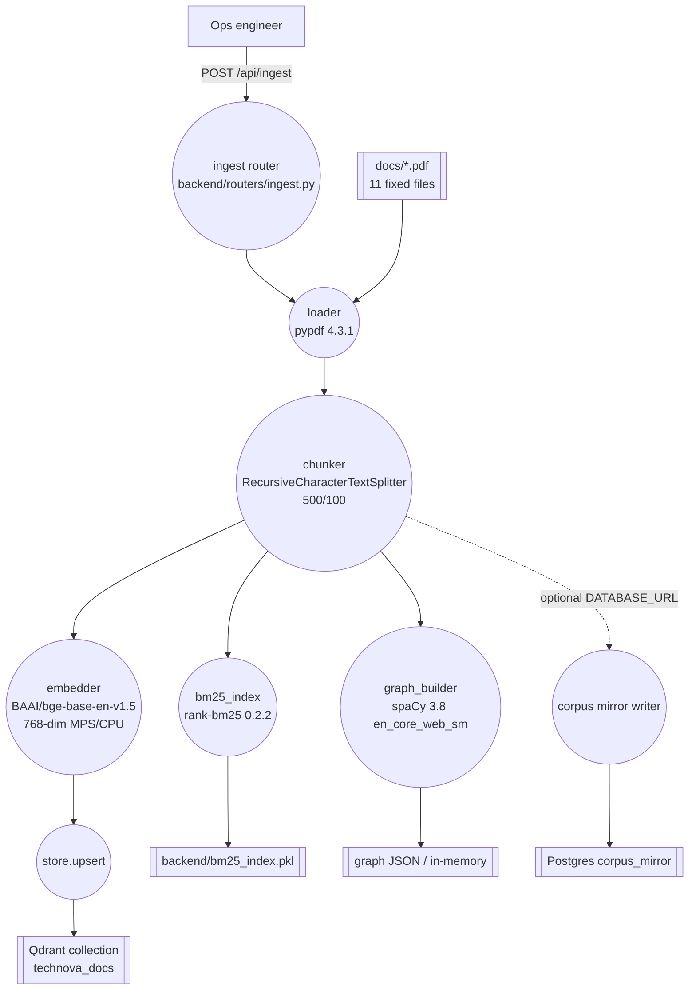
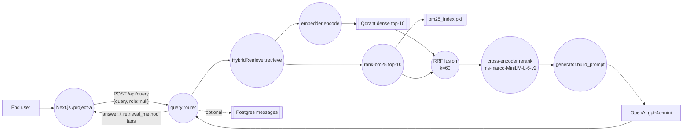
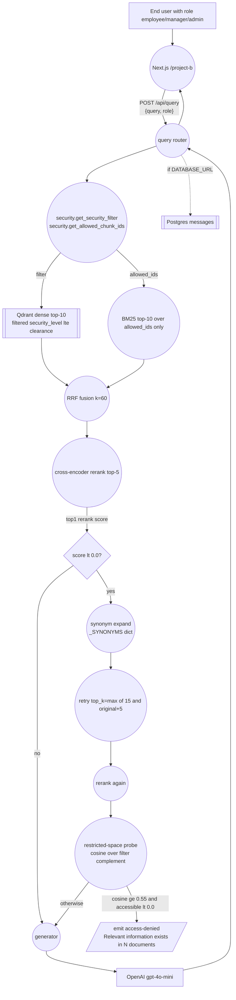
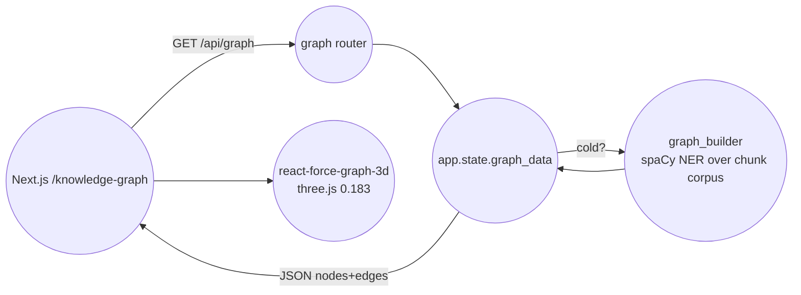

# TechNova RAG — Data Flow Diagrams

| Field | Value |
|---|---|
| Owner | TechNova Trust & Security |
| Classification | INTERNAL |
| Last Reviewed | 2026-04-16 |
| Next Review | 2026-10-16 |
| Version | 1.0 |

## 1. Purpose

This document describes the authoritative data flows for the TechNova RAG platform. It is intended for security review, DPIA corroboration, and architecture onboarding. Diagrams are expressed in Mermaid for engineering review and rendered alongside `architecture-and-ops/ARCHITECTURE.md`.

## 2. Legend

| Shape | Meaning |
|---|---|
| `(( ))` circle | Process (code that transforms data) |
| `[[ ]]` rectangle | Data store (persistent) |
| `[ ]` rectangle | External entity (human, third-party service) |
| Dashed line | Trust boundary crossing |
| Solid arrow | Data-in-motion |

Trust boundary labels (TB-1 … TB-7) match `THREAT_MODEL.md §1`.

## 3. DFD-0 — Context Diagram



Boundaries crossed:

- TB-1 browser to Vercel (HTTPS terminated at Vercel edge).
- TB-2 frontend to backend (CORS-restricted).
- TB-3 backend to Qdrant (in-cluster in prod, compose network in dev).
- TB-4 backend to Neon (TLS asyncpg).
- TB-5 backend to OpenAI (HTTPS, API key auth).
- TB-6 backend to HuggingFace (cold-start model download, no runtime data).

## 4. DFD-1 — Ingest Flow

Triggered by `POST /api/ingest`. Walks the `docs/` directory, skipping any PDF not keyed in `DOCUMENT_METADATA` (`backend/config.py`).



Each produced Qdrant point carries the payload:

```json
{
  "chunk_id": "technova_{doc_slug}_c{index}",
  "doc_slug": "...",
  "doc_name": "...",
  "domain": "HR|Finance|Engineering|...",
  "security_level": 0|1|2|3,
  "security_label": "PUBLIC|INTERNAL|CONFIDENTIAL|RESTRICTED",
  "page_number": 1,
  "text": "..."
}
```

Re-ingestion: `force_reingest=true` drops the Qdrant collection, rebuilds the BM25 pickle, and regenerates graph data. This is a destructive operation and is gated to operator-only.

## 5. DFD-2 — Project A Query Flow (open chat)



Key property: Project A does not pass `get_security_filter(role)` since no role is asserted. It operates over all accessible documents; RESTRICTED documents remain excluded by Project A's product rule (Project A scope is PUBLIC + INTERNAL; see `DATA_CLASSIFICATION_MATRIX.md`). Enforcement in v1.0 is at product level — a hard backend guard for Project A is tracked as Roadmap v1.1.

## 6. DFD-3 — Project B Query Flow (role-gated with self-correcting loop)



Restricted probe output never enters prompt context. It influences only the surface message.

## 7. DFD-4 — Knowledge Graph Flow



Graph contains:

- Nodes: documents, entities (PERSON, ORG, PRODUCT, DATE, GPE extracted by `en_core_web_sm`), topics (inferred from chunk co-occurrence clusters).
- Edges: entity-to-document (entity appears in chunk), document-to-document (co-mention), entity-to-entity (co-occurrence in the same chunk, weighted by frequency).

Project B note: the graph honours document classification — restricted-document nodes and their unique entities are filtered out of the payload before responding when a role with insufficient clearance is asserted. In v1.0 the `/api/graph` endpoint does not take a role parameter; the full graph is exposed and filtering is product-level. Backend-enforced filtering is Roadmap v1.1.

## 8. Trust Boundary Crossings — Control Matrix

| Boundary | Direction | Data in motion | Transport | Authentication | Authorization | Logging |
|---|---|---|---|---|---|---|
| TB-1 Internet → Vercel | Inbound | HTML, JS, query payload | HTTPS (Vercel-managed TLS) | None (public site) | N/A | Vercel access logs |
| TB-2 Frontend → Backend | Inbound to backend | JSON `{query, role?}` | HTTPS | None in v1.0 (demo gap) | CORS allowlist (`backend/main.py`) | `uvicorn` request log |
| TB-3 Backend → Qdrant | Bidirectional | Embeddings, payload, filters | HTTP (dev) / HTTPS + API key (Qdrant Cloud) | API key (prod) | Collection-level | Qdrant logs |
| TB-4 Backend → Postgres | Bidirectional | Chat messages, corpus mirror rows | TLS (asyncpg ssl='require') | Postgres credentials | Role-scoped DB role | Neon query logs |
| TB-5 Backend → OpenAI | Outbound | Prompt (system + context + user query) | HTTPS | `OPENAI_API_KEY` | N/A | OpenAI dashboard |
| TB-6 Backend → HuggingFace | Outbound | Model download requests (cold start only) | HTTPS | None (public models) | N/A | HF CDN logs |
| TB-7 Security data-plane (internal) | Intra-process | `security_level` filters, `allowed_chunk_ids` | In-process | N/A | `get_security_filter` + `get_allowed_chunk_ids` | App log on filter resolution |

## 9. Data Retention in Flow

| Data | Transient / Persistent | Location | Retention |
|---|---|---|---|
| User query | Transient at rest in Postgres if `DATABASE_URL` set | `messages` table | 90 days default, configurable |
| LLM response | Same | `messages` table | 90 days default |
| Retrieved chunk ids | Transient (log only) | stdout | Rotated with container logs |
| Embeddings | Persistent | Qdrant | Indefinite; rebuilt on re-ingest |
| BM25 pickle | Persistent | `backend/bm25_index.pkl` | Indefinite; rebuilt on re-ingest |
| Graph JSON | Persistent or in-memory | `app.state.graph_data` | Rebuilt on startup / re-ingest |

## 10. Revision History

| Version | Date | Author | Summary |
|---|---|---|---|
| 1.0 | 2026-04-16 | TechNova Trust & Security | Initial release |
