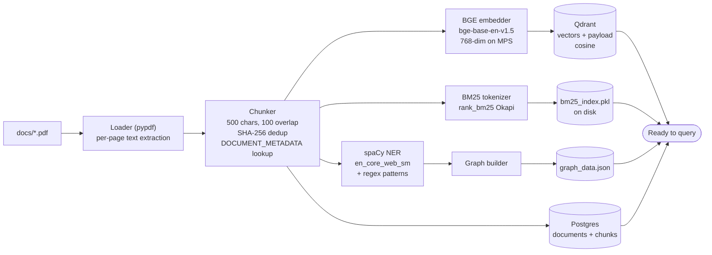
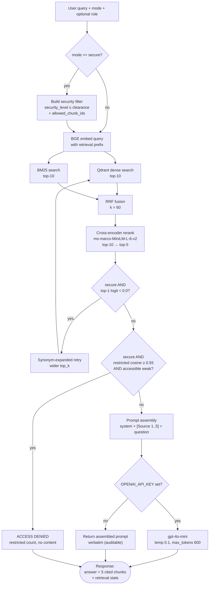
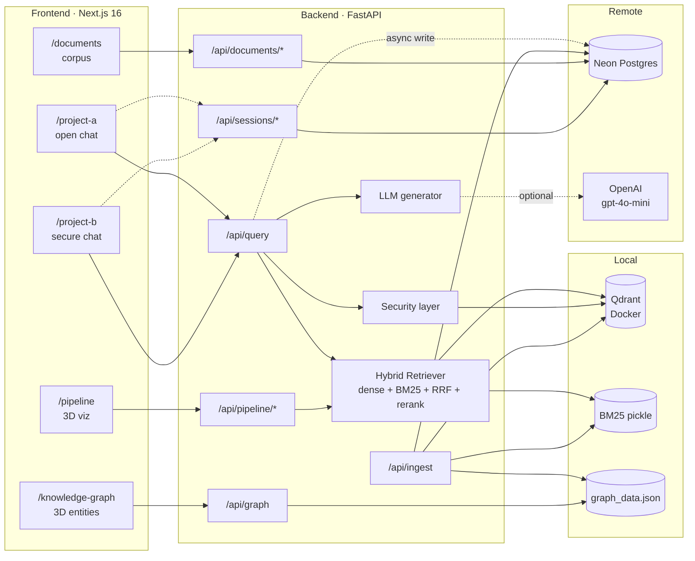

# How the RAG works

## RAG implementation
We built a Retrieval-Augmented Generation pipeline that answers questions by first retrieving the most relevant text chunks from a fixed corpus and then asking a language model to compose an answer grounded in only those chunks. The retrieval half runs entirely on the local machine — embedding, vector search, keyword search, fusion, and reranking — so the corpus content never leaves the box during search. The generation half is the only optional remote step; if the OpenAI key is blank, the system returns the assembled prompt and the cited chunks instead of a generated answer, so the pipeline still produces useful, auditable output.

## Chunking
Documents are split into overlapping passages of roughly 500 characters with a 100-character overlap between consecutive chunks. We use a recursive splitter that tries paragraph breaks first, then line breaks, then sentence boundaries, then words, before falling back to character-level cuts — this keeps semantic units intact most of the time. Each PDF is processed page by page so a chunk never straddles a page break, every chunk inherits its document's metadata, and identical chunks are de-duplicated by SHA-256 hash so repeated boilerplate doesn't bloat the index. The resulting average is around 411 characters per chunk, producing 121 chunks across 11 PDFs.

## How overlap works and how we iterate through a document
The 100-character overlap is a deliberate carry-over between consecutive chunks, not a duplication of stored content. Mechanically the splitter picks the best split point ≤ 500 characters and, when it cuts, takes the last ~100 characters of the previous chunk and prepends them to the next chunk so the two chunks share a 100-char bridge at the boundary; both chunks are stored independently in Qdrant and BM25 with their own chunk_id, their own embedding, and their own token set, so a fact that lands on a boundary survives intact in two chunks and a query targeting that fact has two candidate retrievals to match against. The overlap isn't deduped because neighbouring chunks have unique content beyond the shared bridge — their full-text SHA-256 hashes differ — so dedup only catches byte-identical chunks (typically repeated page footers), not overlapping ones, and in practice our 11-PDF corpus shows zero dedup drops. Iteration is strictly page-by-page, not document-level and not heading-aware: pypdf extracts text one page at a time and the splitter runs separately on each page's text, which means chunks never straddle a page break (a paragraph spanning page 3 to page 4 becomes two chunks with different page_numbers and no overlap between them because overlap only exists within a single page's splitter call), every chunk carries a correct page_number that drives citations, and natural page boundaries isolate headers/footers/watermarks onto small chunks that dedup then removes if they repeat verbatim. We deliberately don't chunk at the whole-document level (would lose page attribution and let chunks span unrelated material) or at the section level via heading parsing (would need per-document format knowledge and doesn't generalise across heterogeneous PDFs); the recursive splitter approximates semantic boundaries well enough because its separator hierarchy — paragraph break, line break, sentence end, word, character — aligns with how policy and business documents are actually formatted.

## Embedding
Each chunk is encoded into a 768-dimensional vector by the BAAI/bge-base-en-v1.5 bi-encoder, which is small enough to run locally on Apple Silicon GPU (MPS) or CPU and strong enough to compete with OpenAI's text-embedding models on retrieval benchmarks. Vectors are L2-normalized so that cosine similarity reduces to a dot product. At query time the question is encoded with the BGE-recommended prefix "Represent this sentence for searching relevant passages:" because BGE was specifically trained with that prefix to widen the gap between relevant and irrelevant passages.

## Vector storage
All chunk vectors live in a single Qdrant collection configured for cosine distance. Alongside the vector, every point stores the chunk's text and a payload of metadata — document name, slug, page number, chunk index, security level and label, domain, char count, content hash. Several payload fields are indexed inside Qdrant so that filtered searches stay fast even as the corpus grows; in particular the security-level index is what makes the role-based pre-filter cheap.

## BM25 (lexical search)
We complement dense retrieval with a classical BM25 keyword index built with rank_bm25. Text is tokenized by a simple lowercased alphanumeric regex, the index is built once during ingest, pickled to disk, and loaded back into memory at startup. Dense embeddings excel at semantic matches but can miss exact identifiers, codenames, or rare terms; BM25 catches exactly those cases, so the union of the two recall sets is more complete than either alone.

## RRF fusion
Dense and BM25 produce scores on different scales, so we don't average them — instead we use Reciprocal Rank Fusion, which gives each chunk a score based on its rank in each list using the formula score = sum of 1 / (k + rank), with k = 60. Chunks that appear high in both lists win, chunks that appear in only one still survive if their rank is good, and the final ordering is robust to score-scale differences between the two retrieval methods. We tag the survivors with whether they came from dense, bm25, or both ("hybrid"), which the UI then surfaces so users can see which retrieval mechanism found each citation.

## Cross-encoder reranking
The top fused candidates are passed through a cross-encoder, ms-marco-MiniLM-L-6-v2, which scores the (query, chunk) pair jointly inside the model rather than comparing two separately encoded vectors. This is far more accurate than the bi-encoder's cosine score because the model can attend across both sequences at once, but it's also far more expensive — so we only rerank the top ten or so candidates from RRF, never the whole corpus. The reranker outputs a single relevance score per pair, we sort descending, take the top five, and those become the cited sources for the answer.

## LLM generation
The reranked top-five chunks are inserted into a prompt template that pins the system instruction (use only the provided context, cite each fact with its source number, never invent facts), formats each chunk as a numbered, document-attributed block, and appends the user's question. We send this to gpt-4o-mini at temperature 0.1 to favour faithful extraction over creative paraphrasing. If no API key is configured, the same assembled prompt is returned to the caller verbatim, which keeps the pipeline auditable and lets you swap in a self-hosted LLM (Ollama, vLLM) by replacing only the generator step.

## Security pre-filtering
For role-gated chat, we filter the corpus to only the chunks the user is allowed to see before any scoring happens. Each role maps to a numeric clearance level (employee=1, manager=2, admin=3) and each chunk carries a security level (0 PUBLIC, 1 INTERNAL, 2 CONFIDENTIAL, 3 RESTRICTED). The filter security_level ≤ clearance is applied in two places that must stay in sync — as a Qdrant payload filter on dense search and as an allow-list of permitted chunk IDs passed into BM25 — so restricted content can never enter the scoring pool through either retrieval channel. This is the core invariant of secure mode: filter at retrieval time, not at display time.

## Self-correcting retrieval
On secure queries, we add two safety behaviours on top of the basic filter. First, if the top reranked chunk has a weak score we automatically retry with a synonym-expanded query (salary ↔ compensation, leave ↔ time off, incident ↔ breach, and similar) and a wider candidate window, keeping the wider result only if it actually improves the top-1 score. Second, we run an informational probe of the restricted-space cosine matches — never returned as content — and if accessible retrieval is weak while restricted retrieval is strong, we surface a clear "access denied" message instead of either leaking content or pretending nothing exists. Both behaviours preserve the security invariant: the user only ever sees what their clearance allows, and they get an honest answer about why.

## Why hybrid + rerank + role-filter together
Each piece compensates for the others. Dense alone misses rare lexical matches; BM25 alone misses paraphrases. RRF combines their recall without trusting either's score scale. The cross-encoder rerank catches mistakes both retrievers make — it sees the query and the chunk together, so it can demote a topical-but-irrelevant match that fooled the bi-encoder. The security filter sits *before* all of it so it cannot be bypassed by a strong retrieval signal. And the LLM at the end is the only stage that ever writes new sentences, but it only sees chunks that survived all the prior gates, so its grounding stays defensible.

## Role-based access and how chunks are used per role
Three roles exist — employee, manager, admin — each mapped to a numeric clearance level (1, 2, 3 respectively), against four document security levels — PUBLIC (0), INTERNAL (1), CONFIDENTIAL (2), RESTRICTED (3) — and the rule is simply that a role can read any chunk whose security level is less than or equal to its clearance, so an employee sees PUBLIC + INTERNAL, a manager adds CONFIDENTIAL, and an admin sees everything including RESTRICTED. Every chunk inherits its parent document's security level into its Qdrant payload and Postgres row at ingest, and that field is indexed inside Qdrant so filtering on it is a cheap index probe rather than a full scan — the clearance travels with the data and the role check at query time reads exactly what was written at ingest. The core invariant of secure mode is that restricted chunks never enter the scoring pool, and that invariant is enforced at both retrieval stages: on the dense side a Qdrant payload filter of the form security_level ≤ clearance is attached to the vector search so the database itself refuses to return ineligible chunks, and on the BM25 side we first call Qdrant's scroll endpoint with the same filter to build an allow-list of permitted chunk IDs which is then passed into the BM25 search so scoring only runs against permitted chunks — both paths must agree or restricted content could leak through one. Filtering happens before scoring, not after, because a naive "score everything then hide restricted chunks from the response" design would let restricted text flow through the reranker, the prompt, and the LLM, any of which could absorb the content into the final answer even with the citation stripped — by filtering at retrieval, restricted chunks never reach the cross-encoder, never reach the prompt, and never reach the model. On top of the basic filter, secure mode adds two safety behaviours: if the top accessible chunk has a weak rerank score we retry with a synonym-expanded query and a wider candidate window (salary ↔ compensation, leave ↔ time off, incident ↔ breach, and similar), keeping the wider result only if it genuinely improves the top-1 score; and separately we run an informational cosine-only probe of the restricted space — those hits are never returned as content — so if accessible retrieval is weak and the restricted probe is strong (cosine ≥ 0.55 by default), we surface an honest "access denied" message naming the count of restricted matches instead of either pretending nothing exists or leaking a guess. The concrete effect is that a single RESTRICTED chunk from, say, the Salary Structure PDF is always written to storage regardless of who queries, but when an employee or manager submits a query Qdrant's filter rejects it before scoring and the BM25 allow-list never contains its chunk_id so both retrievers behave as if the chunk doesn't exist, whereas for an admin the filter admits it into both scoring pools where it competes normally and can become a citation — same chunk, same score function, three different outcomes driven entirely by the role's clearance. This is structurally safer than prompt-level filtering because asking the LLM not to reveal restricted information is a suggestion, not a boundary; in this system the LLM never sees restricted content for an ineligible role because the text is not present in the context window, which means prompt injection, jailbreaks, or the model misunderstanding its system instruction cannot leak restricted text — the security property is enforced by the retrieval layer, not hoped for from the model.

## Which models run locally, and which are remote
Three models run entirely on the local machine with no network calls during retrieval, and one remote model is used only for the final answer. The embedder is BAAI/bge-base-en-v1.5, a 768-dimensional bi-encoder pulled from the Hugging Face Hub (weights ~438 MB, cached under ~/.cache/huggingface after the first download) and loaded at backend startup via the sentence-transformers library, pinned to Apple Silicon GPU (MPS) with a CPU fallback. The reranker is cross-encoder/ms-marco-MiniLM-L-6-v2, also from Hugging Face (~90 MB), loaded on MPS and used to re-score the top candidates from RRF. The third local model is spaCy's en_core_web_sm (~12 MB, CPU-only), used during ingest to extract entities for the knowledge graph — people, organizations, dates, amounts — which we augment with regex patterns for domain-specific things like L-levels, INR amounts, policy names, and internal system URLs. The only remote model is gpt-4o-mini (OpenAI), called at the very end to turn the retrieved chunks into a natural-language answer; it sees nothing except the chunks the retriever already selected, and if the OPENAI_API_KEY is blank the generator just returns the assembled prompt verbatim so the rest of the pipeline still works offline. All three local models are swappable via environment variables (EMBEDDING_MODEL, RERANKER_MODEL, LLM_MODEL) — you can drop in bge-small for less RAM, bge-large for more accuracy, or bge-reranker-base as an alternative to MiniLM, though changing the embedding dimension requires a full re-ingest because Qdrant's collection is fixed at 768-dim.

## Which reranking model and technique
The reranking model is cross-encoder/ms-marco-MiniLM-L-6-v2 — a 6-layer MiniLM transformer with roughly 23 million parameters, trained by the sentence-transformers team on the MS MARCO passage ranking dataset (about 500k real search queries paired with human-judged relevant and irrelevant passages). The technique is cross-encoder pairwise scoring, which is mechanically different from the bi-encoder BGE we use for initial retrieval: a bi-encoder encodes the query and the chunk separately into fixed vectors and compares them with cosine similarity (fast, but the model never sees both texts together), while a cross-encoder concatenates the query and the chunk into one input like [CLS] query [SEP] chunk [SEP] and runs the full transformer over the combined sequence so every token of the query can attend to every token of the chunk, outputting one relevance score per pair. That joint attention catches fine-grained mismatches (right topic, wrong specifics) that the bi-encoder's single-vector comparison misses. We apply it in the canonical two-stage retrieve-then-rerank pattern: the bi-encoder + BM25 fetch a cheap recall pool, RRF fuses them into ten top candidates, and only those ten go through the expensive cross-encoder — full-corpus cross-encoder scoring would be prohibitively slow on any non-trivial corpus, while bi-encoder-only ranking loses precision. The reranker's output is a raw logit (positive means likely relevant, negative means likely irrelevant, uncalibrated), we sort descending and take the top five as the final cited sources. The secure-mode "weak top-1" threshold that triggers synonym expansion is set against this same scale (threshold 0.0), which is why a negative top-1 rerank score is the signal that accessible retrieval has failed and the system should self-correct.

## Retrieval scores and thresholds we set
We use two kinds of numeric settings. The first is tunable pipeline parameters: chunk_size=500 and chunk_overlap=100 at ingest, top_k_retrieval=10 for how many candidates each retriever fetches, top_k_final=5 for the cited sources, rrf_k=60 for the fusion smoothing constant, and LLM temperature=0.1 with max_tokens=600 for grounded answers. The second is two fixed thresholds inside the secure-mode self-correcting loop — weak_top1_threshold=0.0 (the cross-encoder rerank score below which accessible retrieval is considered weak and triggers synonym expansion or access-denied) and restricted_cosine_threshold=0.55 (the bi-encoder cosine in the restricted-space probe above which a restricted match is considered strong enough to warrant denying rather than returning a mediocre accessible answer). The 0.0 rerank threshold is deliberately model-agnostic — a negative logit means the cross-encoder itself thinks the best accessible chunk is closer to irrelevant than relevant — and 0.55 sits above the BGE similarity noise floor (random pairs cluster below 0.3, loosely related pairs around 0.4) so it catches strong matches without false positives. Implicit filters exist too: BM25 drops zero-score hits because a zero means no query token appeared in the chunk, and dense search has no cosine cutoff because the reranker is meant to be the quality gate. We deliberately don't apply a hard numeric floor to rerank scores in open mode — the top-5 is always returned — and instead lean on the LLM's system instruction ("only use the provided context, say so if the context doesn't contain the answer") to prevent confident wrong answers from weak retrievals. Hard thresholds on uncalibrated cross-encoder logits are brittle across different corpora, so this contract — two-stage rerank plus a grounded LLM prompt — generalises better than a numeric floor would.

## Document tagging for role-based access
Every PDF in the corpus is tagged once, centrally, in a single DOCUMENT_METADATA dictionary in backend/config.py that maps the raw filename (e.g. TechNova_Salary_Structure.pdf) to a record of doc_slug, doc_name, domain, security_level (0–3), and security_label (PUBLIC / INTERNAL / CONFIDENTIAL / RESTRICTED). That dictionary is the single source of truth — if a PDF isn't listed there it's silently skipped during ingest, which is how we guarantee no untagged document ever enters the index. At ingest time, for each PDF the chunker looks up the filename in DOCUMENT_METADATA and copies the whole metadata record into every chunk that file produces, so a 35-chunk HR Handbook ends up with 35 chunks that each carry domain="HR", security_level=1, security_label="INTERNAL" in their Qdrant payload and Postgres row. The security_level field is indexed inside Qdrant as an integer payload index, which is what makes the role-based pre-filter a cheap index probe instead of a full scan. The tag then drives two filter paths at query time that must stay in sync: Qdrant's dense search gets a payload filter of security_level ≤ clearance, and BM25 gets an allow-list of permitted chunk IDs built by calling Qdrant's scroll endpoint with the same filter. Changing a document's tag requires a re-ingest (or at minimum a backfill call) because the tag is baked into every chunk's payload — you can't just flip the document row in Postgres and expect retrieval to respect it, because Qdrant and the BM25 pickle hold their own copies. The design choice to tag at the document level rather than per-chunk keeps the operational model simple (one row per document to review, not one row per chunk) and matches how access control actually works in practice — security classification is a property of the source document, not of individual paragraphs within it.

## Complex example queries to exercise the pipeline
For open mode (Project A, no role required), a good cross-document synthesis query is "If a senior engineer goes on maternity leave during a P1 incident, what does company policy say about on-call coverage, leave entitlement, and who approves the handover?" — this pulls from HR Handbook, OnCall Runbook, and Platform Architecture so the reranker has to balance three unrelated source documents in the top-5, and BM25 catches exact terms like "P1" and "handover" while BGE handles the semantic overlap. Another good one is "What does the Q4 financial report say the revenue was, what did the product roadmap commit to delivering that quarter, and did vendor contracts align with that spend?" — forces the LLM to cite specific numbers from Q4 Financial Report, Product Roadmap 2026, and Vendor Contracts all in the same answer. A multi-hop procedural question is "A new engineer's laptop was compromised — walk me through the IT asset policy for revocation, the on-call runbook for incident declaration, and what training they need to retake" which tests whether the retriever finds the Training doc even though the word "retake" never appears in it. A synonym stretch worth running is "How is variable pay structured, what are the compensation bands, and when are bonuses approved?" — in open mode the Salary Structure chunks come back as top hits, giving you a baseline to compare against secure mode. For secure mode (Project B, role-gated), the cleanest access-denied test is asking "What is the CEO's total compensation including bonus and stock grants?" as an employee — expect the access-denied banner, zero final chunks, security stage active, restricted probe count of three or more with top cosine above 0.65; re-running the same query as admin produces the full answer from Salary Structure, same retrieval pipeline, different outcome driven entirely by the clearance filter. A boundary-straddling manager query is "Summarize the Q4 financial performance and link it to any board-level decisions that quarter" — the manager gets the Q4 Financial Report part (CONFIDENTIAL, allowed) but Board Minutes Q4 (RESTRICTED) is blocked, so you get a deliberately partial answer with the restricted probe showing strong matches that weren't returned; the admin version gets both and can synthesize. To watch the self-correcting retry fire, try "What's the pay structure for senior roles?" as admin — the word "pay" weakly matches HR Handbook language that uses "compensation" and "variable pay", so the trace should show self_correction_applied set to true with an expanded_query field listing the synonyms that were added. A security-sensitive query with a strong lexical trap is "Were there any incidents involving unauthorized access to customer data in Q4?" — as employee this triggers access-denied because BM25 scores "unauthorized access" and "customer data" strongly against the Security Incident Report chunks, making the restricted probe cosine very high; as admin it returns the incident details with high dense-BM25 overlap in the trace because both semantic and lexical signals point to the same chunks. Finally, a topic crossover that surprises is "How does our vendor spend compare to the engineering headcount budget?" as a manager — Vendor Contracts (CONFIDENTIAL) is allowed but the Salary Structure chunks where headcount cost tables live (RESTRICTED) are blocked, so the answer comes back deliberately incomplete and the restricted-probe data tells you exactly what was missing and why.

## How chunk count is decided
We don't set chunk count directly — it's emergent from three inputs: the document's extracted text length, the chunk_size=500 character budget, and the chunk_overlap=100 carry-over. The recursive splitter walks through each page's text, cuts at the best available separator (paragraph break first, then line break, sentence end, word, character) that keeps each chunk ≤ 500 characters, and prepends the last ~100 characters into the next chunk. The rough formula for a page of length N characters is ceil((N − overlap) / (chunk_size − overlap)), so a page of 1800 chars produces roughly 5 chunks — the actual result is usually slightly smaller than this upper bound because the splitter prefers an early cut at a paragraph or sentence boundary over hitting exactly 500 chars, which is why the corpus-wide average is ~411 characters (not 500) and the HR Handbook's 9 pages produce 35 chunks rather than the theoretical ceiling of ~45. Any doc's count is re-derivable from its character total: Q4 Financial Report has 3031 chars → 7 chunks (avg 433), Salary Structure 3478 → 9 (avg 386), HR Handbook 14406 across 9 pages → 35 (avg 411). Changing counts globally is a matter of changing CHUNK_SIZE or CHUNK_OVERLAP in backend/.env and re-ingesting — smaller size means more chunks per document (tighter precision, more fragments to rank), larger overlap means boundary facts survive in more chunks (better recall at boundaries, more storage). The 500/100 default is a well-established sweet spot for BGE-class embedders on policy/business text: small enough that one chunk encodes one idea, large enough that a single chunk usually carries complete context.

## What k is for reranking
There are three different k-values in the retrieval pipeline and they mean different things. The first is top_k_retrieval=10 — how many candidates each retriever independently fetches (dense pulls the top 10 from Qdrant by cosine, BM25 pulls the top 10 by BM25 score); this sets the size of the recall pool before fusion. The second is RRF's k=60 inside the formula score = sum of 1 / (k + rank) — this is not a candidate count at all, it's a mathematical smoothing constant from the original RRF paper (Cormack et al.) that controls how fast score contributions decay with rank; smaller k rewards top ranks aggressively, larger k flattens the curve and gives lower-ranked items more voice, and 60 is the paper's recommended default which we've left untuned. The third is the rerank pool — max(top_k_retrieval, top_k_final), which with defaults equals max(10, 5) = 10 — and this is what controls what the cross-encoder actually sees: after RRF fusion we take the top 10 chunks from the fused list and pass only those to the cross-encoder, which scores each (query, chunk) pair, sorts descending, and slices to the final top_k=5 that becomes the cited sources for the answer. We picked a rerank pool of 10 rather than 25 or 50 because cross-encoder scoring is the expensive stage (about 150 ms for 10 pairs on Apple Silicon MPS, roughly 5× that for 50), the fused list rarely has more than 10–15 unique strong candidates on a 121-chunk corpus, and the cross-encoder's top-5 output is very stable when the pool is in the 8–15 range — extending further burns compute on noise. If the corpus grew to thousands of docs, the right move would be to raise top_k_retrieval to 25 or 50 because the dense/BM25 top-10 becomes less likely to contain the true best answer as the search space expands.

| name | default | meaning |
|---|---|---|
| top_k_retrieval | 10 | chunks each retriever fetches (dense and BM25, independently) |
| RRF k | 60 | smoothing constant in 1 / (k + rank); not a count |
| rerank pool | max(top_k_retrieval, top_k_final) = 10 | candidates fed to the cross-encoder |
| top_k_final | 5 | final cited chunks returned to the UI and LLM |

## Models at a glance

| Stage | Model | Source | Size | Device | Role in pipeline |
|---|---|---|---|---|---|
| Embedding (query + chunks) | BAAI/bge-base-en-v1.5 | Hugging Face | ~438 MB | MPS / CPU | Bi-encoder producing 768-dim cosine vectors for dense retrieval over Qdrant |
| Reranking | cross-encoder/ms-marco-MiniLM-L-6-v2 | Hugging Face | ~90 MB | MPS / CPU | Cross-encoder scoring (query, chunk) pairs jointly to cut top-10 fused candidates down to top-5 |
| NER (graph build) | spaCy en_core_web_sm | spaCy | ~12 MB | CPU | Extracts entities (people, orgs, dates, amounts) from every chunk during ingest for the knowledge graph |
| Keyword search | rank_bm25 (Okapi BM25) | PyPI | — | CPU | Classical lexical index complementing dense retrieval; picklable to disk, reloaded in-memory at startup |
| Answer generation | gpt-4o-mini | OpenAI API | — | Remote | Composes the final natural-language answer from the top-5 chunks; optional, skipped if no API key |
| Graph relationship extraction | gpt-4o-mini | OpenAI API | — | Remote | Optional: extracts subject-predicate-object triples between entities; falls back to co-occurrence edges without a key |

## Architecture and pipeline flow

> **To see the flow charts rendered in VS Code**, install the extension **“Markdown Preview Mermaid Support”** (publisher `bierner`). Then reopen the preview — the Mermaid diagrams below will render as proper flow charts. They already render automatically on GitHub, GitLab, and Notion. ASCII versions are included below every Mermaid block as a universal fallback.

### Ingest pipeline — flow chart



### Query pipeline — flow chart



### Component layout — flow chart



### Ingest pipeline — ASCII fallback

### Ingest pipeline (one-time, rerun on corpus change)

```
  docs/*.pdf
      │
      ▼
  ┌────────────────────────┐
  │ Loader  (pypdf)        │  per-page text extraction
  │ skips empty/scanned    │  returns [{page_number, text}, ...]
  └────────────┬───────────┘
               │
               ▼
  ┌─────────────────────────────────┐
  │ Chunker                         │  RecursiveCharacterTextSplitter
  │   chunk_size=500                │  separators: \n\n, \n, ". ", " "
  │   chunk_overlap=100             │  SHA-256 dedup
  │   DOCUMENT_METADATA lookup      │  inherits doc_slug + security_level
  └───┬─────┬──────┬──────┬─────────┘
      │     │      │      │
      │     │      │      └──────────────────► Postgres
      │     │      │                            (documents + chunks tables,
      │     │      │                             via Neon, async)
      │     │      │
      │     │      └─► spaCy NER + regex patterns
      │     │              │
      │     │              ▼
      │     │         Graph builder
      │     │              │
      │     │              ▼
      │     │         graph_data.json  (on disk)
      │     │
      │     └─► BM25 tokenize (rank_bm25 Okapi)
      │              │
      │              ▼
      │         bm25_index.pkl  (pickled, loaded at startup)
      │
      └─► BGE embed  (bge-base-en-v1.5, 768-dim, MPS)
               │
               ▼
          Qdrant  (cosine collection, payload-indexed
                   on security_level, org_id, domain, doc_slug)
```

### Query pipeline — ASCII fallback

```
  User query + mode (open|secure) + optional role
      │
      ▼
  ┌─ mode == secure ? ─┐
  │                    │
  │ yes                │ no
  ▼                    │
  Build security filter│
    security_level ≤   │
    role_clearance     │
  + allowed_chunk_ids  │
    allow-list         │
  │                    │
  └─────────┬──────────┘
            │
            ▼
  ┌──────────────────────┐
  │ BGE embed query      │  (with BGE retrieval prefix)
  └──────────┬───────────┘
             │
    ┌────────┴────────┐
    │                 │
    ▼                 ▼
  ┌────────┐      ┌──────────┐
  │ Qdrant │      │   BM25   │   each returns top-10
  │ top-10 │      │  top-10  │   (payload filter / allow-list if secure)
  └────┬───┘      └────┬─────┘
       │               │
       └───────┬───────┘
               ▼
       ┌─────────────────┐
       │   RRF fusion    │  k=60
       │  Σ 1/(k+rank)   │  tags: dense / bm25 / hybrid
       └────────┬────────┘
                │  top ~10 fused
                ▼
       ┌────────────────────────────┐
       │  Cross-encoder rerank      │  ms-marco-MiniLM-L-6-v2
       │  10 pairs → logit scores   │  sort desc, slice to top 5
       └────────────┬───────────────┘
                    │
                    ▼
       ┌─ secure AND top-1 rerank score < 0.0 ? ─┐
       │                                         │
       │ yes                                     │ no
       ▼                                         │
       Synonym-expanded retry with               │
       wider top_k_retrieval                     │
       (keep if improves top-1)                  │
       │                                         │
       └─────────────────┬───────────────────────┘
                         │
                         ▼
       ┌─ secure AND restricted-probe cosine ≥ 0.55 ─┐
       │  AND accessible top-1 weak ?                │
       │                                             │
       │ yes ──► ACCESS DENIED                       │
       │        (return restricted count,            │
       │         no content leaked)                  │
       │                                             │ no
       └─────────────────┬───────────────────────────┘
                         │
                         ▼
       ┌──────────────────────────────┐
       │ Prompt assembly              │  system instruction
       │  + [Source 1..5] blocks      │  + cited chunks
       │  + user question             │
       └──────────────┬───────────────┘
                      │
                      ▼
       ┌─ OPENAI_API_KEY configured ? ─┐
       │                               │
       │ no                            │ yes
       ▼                               ▼
       Return assembled                gpt-4o-mini
       prompt verbatim                 temperature=0.1
       (auditable fallback)            max_tokens=600
       │                               │
       └───────────────┬───────────────┘
                       │
                       ▼
         Response: answer + 5 cited chunks
                 + retrieval_stats (per-stage counts, timings)
                 + access_denied flag + session_id
         (async write to Postgres: sessions, messages, query_runs)
```

### Component layout — ASCII fallback

```
┌────────────────────────────────────────────────────────────────┐
│                    Frontend  (Next.js 16)                      │
│                                                                │
│   /                   /project-a       /project-b              │
│   (landing)           (open chat)      (secure chat)           │
│                                                                │
│   /documents          /pipeline        /knowledge-graph        │
│   (corpus browser)    (3D pipeline)    (3D entity graph)       │
│                                                                │
│   shared:  lib/api.ts · lib/theme.ts · ChatSidebar ·           │
│            SourcePanel · SessionsSidebar                       │
└─────────────────────────────┬──────────────────────────────────┘
                              │  HTTP
                              ▼
┌────────────────────────────────────────────────────────────────┐
│                   Backend  (FastAPI, Python 3.12)              │
│                                                                │
│   POST /api/query          → Hybrid Retriever + Security +     │
│                              LLM generator                     │
│   POST /api/ingest         → loader + chunker + embedder +     │
│                              graph builder + PG mirror         │
│   GET  /api/documents/*    → Postgres reads                    │
│   POST /api/documents/sync → backfill from Qdrant              │
│   GET  /api/pipeline/*     → architecture + live trace         │
│   GET  /api/graph          → cached graph_data.json            │
│   GET  /api/sessions/*     → Postgres chat history             │
│   GET  /api/status         → Qdrant + PG + model health        │
│                                                                │
│   Singletons on app.state: embedder, reranker,                 │
│                            Qdrant client, BM25 index           │
└───────────────┬─────────────────────────────┬──────────────────┘
                │                             │
                ▼                             ▼
   ┌──────────────────────┐      ┌──────────────────────────────┐
   │   LOCAL  (no network)│      │          REMOTE              │
   │                      │      │                              │
   │  Qdrant  (Docker)    │      │  Neon Postgres (asyncpg)     │
   │   technova_docs      │      │   • documents                │
   │   768-dim cosine     │      │   • chunks                   │
   │                      │      │   • sessions                 │
   │  bm25_index.pkl      │      │   • messages                 │
   │   (on disk)          │      │   • query_runs               │
   │                      │      │                              │
   │  graph_data.json     │      │  OpenAI (optional)           │
   │                      │      │   gpt-4o-mini                │
   └──────────────────────┘      └──────────────────────────────┘
```

### One-line summary of the data path

```
INGEST:  PDF → pages → chunks (500/100) → [ vectors → Qdrant ]
                                        → [ tokens  → BM25 pickle ]
                                        → [ entities→ graph.json ]
                                        → [ metadata→ Postgres ]

QUERY:   query → (secure filter?) → BGE embed + BM25 → RRF → rerank
              → (self-correct?)  → (access-denied?)
              → prompt → gpt-4o-mini (or prompt-only fallback)
              → answer + 5 cited chunks + stats
```
